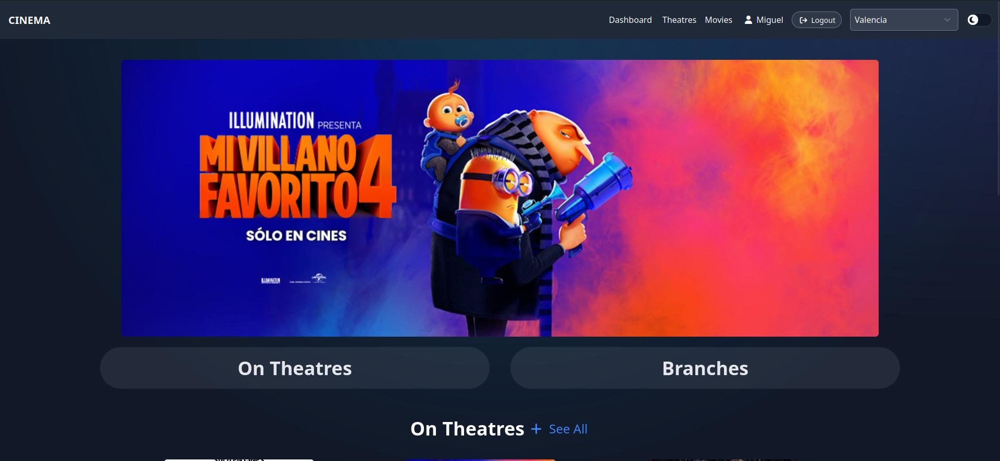
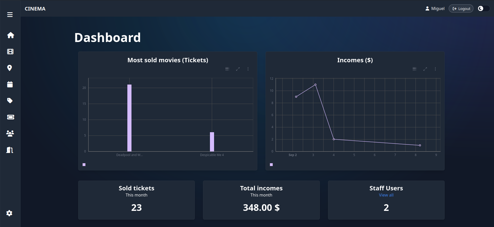
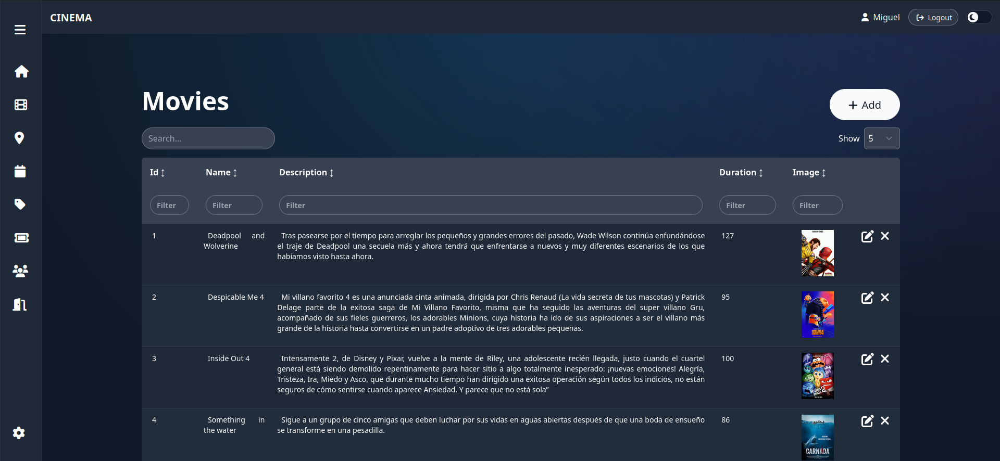
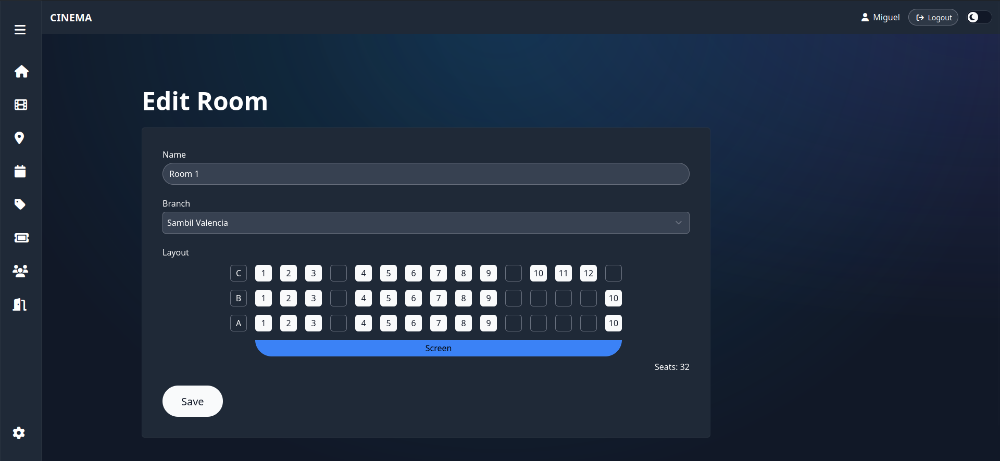
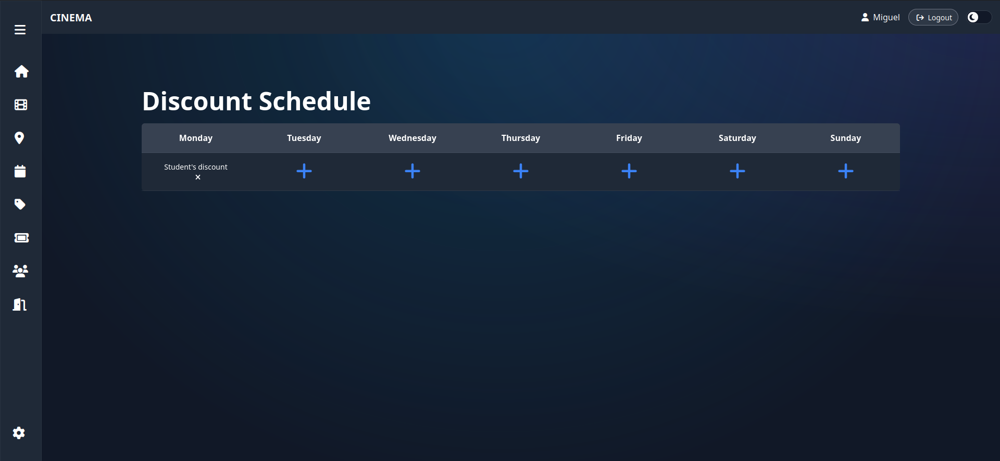
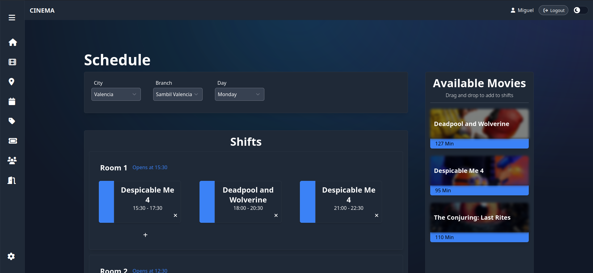
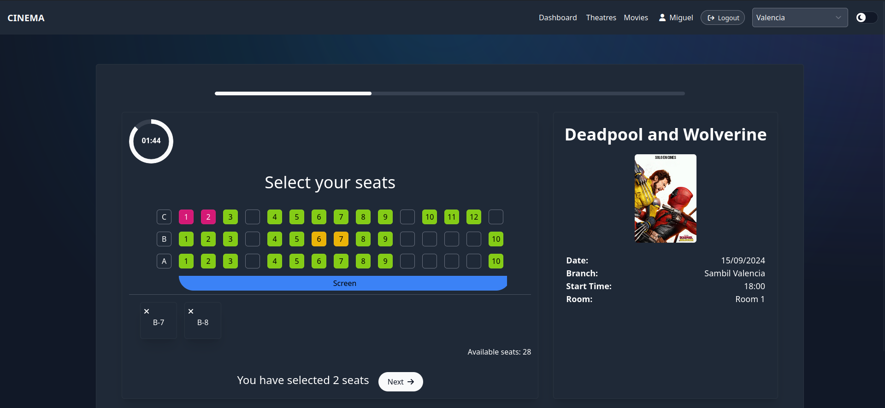
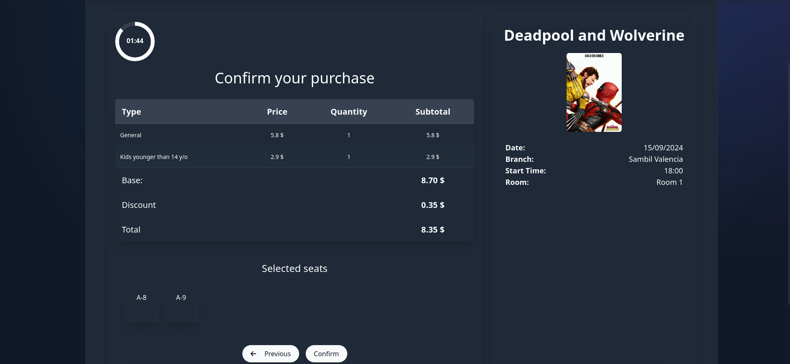

# Cinema App | Capstone CS50W

# Overview

This is the capstone project I made for CS50W. In this project I have developed
a full stack web application that can be used by a Cinema Company to address
session booking in the user's side and the resource managment in the staff/admin dashboard.

# Distinctiveness and Complexity

I highly consider that this project satisfies and even overflows in complexity because of the use of Django REST Framework
and Svelte, different Javascript framework than React, which, while serving as an alternative with many differences, also makes the front-end rendering faster and it is also used Skeleton UI, a UI library that allows the interface to have more uniform styles throughout the components being based of Tailwind CSS library, which is also an alternative for Bootstrap but still making the page fully responsive for mobile devices. Moreover, the front-end includes charts that are based on Carbon Charts library.

As for Django, it is implemented the Django-Q module, which makes scheduling daily tasks possible as for the creation of sessions, also for the session seats selection a websocket module has been implemented, Django channels, which through its consumers, it allows the web applicaton to perfom real time page updates based on signals sent and received from the front and backend, allowing users to check if a seat has been already selected or not in the room which the session will be.

Altogether, it sets a substantial difference from all of the course projects and the user side is based on many cinema websites, however, the dashboard has been fully designed for the project's needs.

### 📑 Project requirements

- [x] Your web application must be sufficiently distinct from the other projects in this course (and, in addition, may not be based on the old CS50W Pizza project), and more complex than those: This project is highly different than the previous CS50W projects and aims for another level of complexity.
       
- [x] Your web application must utilize Django (including at least one model) on the back-end and JavaScript on the front-end: This project uses Django REST framework for the backend including 16 custom models. It uses Svelte, a JavaScript framework on the front-end.
- [x] Your web application must be mobile-responsive: The project application is totally responsive.


### 📁 File contents

- `./backend`: django backend project folder
    - `capstone/`: project folder
        - `media/`: folder where the uploaded files are saved
            - `ads/images/`: for saving ad images
            - `bills/qr-codes/`: for saving qr codes images
            - `branches/images/`: for saving theatres/branches images
            - `movies/preview-images/`: for saving movie preview images
        - `settings/`: for saving settings for local and production enviroments
            - `local.py`: for saving local enviroment settings
        - `asgi.py`: where the http and the websocket routing is configured

    - `cinema/`: cinema backend app folder
        - `admin.py`: registers django orm tables into django's admin page
        - `apps.py`: contains app cinema app configuration
        - `consumers.py`: contains the consumers for django channels in cinema app (websockets)
        - `helpers.py`: contains functions for user access token generation and validation, also provides
        a safe viewset class that can be reused throughout the project to avoid actions from unauthorized users and
        the email sending thread.
        - `models.py`: contains all the models
        - `routing.py`: contains the url patterns for the consumers in django channels
        - `serializers.py`: contains all the JSON serializers that will be used in the views
        - `tasks.py`: contains the task that is executed daily in order to post the next cinema sessions as in the schedule
        - `urls.py`: contains all of the url patterns and routers for the views
        - `views.py`: contains all of the functions in order to send JSON responses to the front-end

    - `.env`: saves enviromental variables
    - `Dockerfile`: contains python image
    - `requirements.txt`: contains all pip modules to install

- `./frontend`: svelte front-end project folder
    - `src/`: contains the svelte components and routes
        - `lib/components`: contains some individual svelte components used throughout the front-end
            - `data.ts`: contains function that fetches json data from front-end, used in the datatable
            - `Datatable.svelte`: datatable main component, which is based on Skeleton UI datatable code
            - `DatatableHeader.svelte`: header used on top of the header in routes
            - `dnd.js`: provides drag and drop functions that are used in other routes and components
            - `Form.svelte`: form component that receives a list of fields with the respective table in order to add or edit an entry of the database deppending on how it is called from other components
            - `LayoutField.svelte`: provides a form field to create or edit the layout of the rooms in the cinema theatres by rows, columns, and spaces (that might count as stairs)
            - `Pagination.svelte`: pagination used in datatable
            - `RowCount.svelte`: row count used in datatable
            - `Search.svelte`: search used in datatable
            - `SeatSelection.svelte`: similar to LayoutField.svelte, it displays the layout of the room of a cinema theatre and has functions to select, free and block seats inside of the layout
            - `ThFilter.svelte`: table heading filter used in the datatable
            - `ThSort.svelte`: table heading sort used in the datatable
        - `routes/`: provides all of the route components used in the front-end
            - `(app)/`: svelte layout folder for user side app 
                - `+layout.svelte`: layout component
                - `+page.svelte`: homepage
                - `bills/[id]`: page for rendering bill details including qr code
                    - `+page.js/`: loads the id parameter of the url
                    - `+page.svelte/`: page component
                - `branches/`: route for cinema branches or theatres
                    - `+page.js`: fetches the list of branches
                    - `+page.svelte`: branches component
                    - `[id]/`: folder for viewing a specific branch
                        - `+page.js`: retrieves id parameter
                        - `+page.svelte+`: page component
                    - `login/`: route for login
                        - `+page.svelte`: page component
                    - `movies/`: route for cinema movies
                        - `+page.svelte`: page component that shows all the available movies
                        - `coming-soon/`: route for movies flagged as coming soon
                            - `+page.svelte`: page component
                        - `[id]/`: route for viewing a specific movie information
                            - `+page.js`: loads the id parameter
                            - `+page.svelte`: page component
                    - `password-reset`: password reset route
                        - `+page.svelte`: page component that shows a "link sent to email" message
                        - `[uidb64]/`: route to the password reset form
                            - `[token]/`: route that also uses the token code in the url
                            - `+page.svelte`: page component that has a password reset form
                    - `profile/`: route that shows user profile
                        - `+page.svelte`: page component
                    - `register/`: route for user registration
                        - `+page.svelte`: page component
                    - `sessions/[id]/`: route for specific session
                        - `+page.js`: retrieves the id parameter
                        - `+page.svelte`: page component that uses the SeatSelection.svelte component
            - `(dashboard)/dashboard/`: svelte layout folder for staff/admin dashboard
                - `+layout.svelte`: layout component for dashboard including authorization
                - `+page.svelte`: dashboard homepage that uses carbon js charts to display ticket and movie information
                - `profile/`: route that shows staff/admin profile
                - `settings/`: route for settings
                    - `+layout.svelte`: layout for settings component
                    - `+page.svelte`: page component 
                - `(tables)/`: svelte layout folder for dashboard tables
                    - `+layout.svelte`: layout component including the Datatable.svelte component
                    - `age-discounts/`: age discounts table
                        - `+page.svelte`: page component
                        - `[id]/+page.svelte`: component for editing age discount entry
                        - `add/+page.svelte`: component for adding age discount entry
                    - `bills/`: bills table
                        - `+page.svelte`: page component
                        - `[id]/+page.svelte`: component for editing bill entry
                        - `add/+page.svelte`: component for adding bill entry
                    - `cities/`: cities table
                        - `+page.svelte`: page component
                        - `[id]/+page.svelte`: component for editing city entry
                        - `add/+page.svelte`: component for adding city entry
                    - `day-discounts/`: day discounts table
                        - `+page.svelte`: page component
                        - `[id]/+page.svelte`: component for day discount entry
                        - `add/+page.svelte`: component for day discount entry
                    - `discount-schedule/`: discount schedule route
                        - `+page.svelte`: page component
                    - `movieads/`: movie ads table
                        - `+page.svelte`: page component
                        - `[id]/+page.svelte`: component for movie ad entry
                        - `add/+page.svelte`: component for movie ad entry
                    - `movies/`: movies table
                        - `+page.svelte`: page component
                        - `[id]/+page.svelte`: component for movie entry
                        - `add/+page.svelte`: component for movie entry
                    - `rooms/`: rooms table
                        - `+page.svelte`: page component
                        - `[id]/+page.svelte`: component for room entry
                        - `add/+page.svelte`: component for room entry
                    - `staff/`: staff users table
                        - `+page.svelte`: page component
                        - `[id]/+page.svelte`: component for staff user entry
                        - `add/+page.svelte`: component for staff user entry
                    - `ticket-types/`: ticket types table
                        - `+page.svelte`: page component
                        - `[id]/+page.svelte`: component for ticket type entry
                        - `add/+page.svelte`: component for ticket type entry
                    - `tickets/`: tickets table
                        - `+page.svelte`: page component
                        - `[id]/+page.svelte`: component for ticket entry
                        - `add/+page.svelte`: component for ticket entry
                    - `users/`: users table
                        - `+page.svelte`: page component
                        - `[id]/+page.svelte`: component for user entry
                        - `add/+page.svelte`: component for user entry

            - `+layout.svelte`: main layout of the front-end 
        - `stores/`: contains all of the javascript store files
            - `auth.js`: functions for local storage and authentication of users
            - `cinema.js`: functions for cinema tables retrieved from django viewsets
            - `form.js`: localstorage for form fields when reloading 
    - `.env`: contains the enviroment variables for the front-end
    - `Dockerfile`: contains the Node JS image needed to run SvelteKit

- `docker-compose.yaml`: docker compose file that runs both front and backend images simultaneously

### ▶ How to run
- Install [Docker](https://www.docker.com/)
- Install [Docker Compose](https://docs.docker.com/compose/)

- In the base folder, run:
    - ```$ docker-compose build```
    - ```$ docker-compose up```

## Additional information

### 🏗 Models incorporated

- `Discount`: Holds discounts with different percentages and purposes

- `Weekday`: Holds information about weekdays that might contain discounts

- `TicketType`: Provides many TicketTypes

- `Ticket`: Holds information about tickets

- `Bill`: Holds all of the information of the bills when buying movie tickets

- `Movie`: Provides information about movies including its images

- `Shift`: Sets the time where a session will be opened in the Cinema, for a specific room and movie.

- `Session`: Addresses the period of time, the room and the selected seats for a cinema session

- `Room`: Holds information about rooms including its branch and the seats layout of the room

- `City`: Includes the name, address and also the movies that are available for that region

- `Branch`: Holds information about the theatre or branch from a specific city

- `MovieAd`: Includes the movie and a image to display at the homepage carousel as an ad

- `SessionGroup`: Includes the data and users saved within a websocket connection in the sessions page

- `SessionChannel`: Includes the selected seats within a websocket connection in the sessions page

### Screenshots
- 
- 
- 
- 
- 
- 
- 
- 

### 💡 Acknowledgements
- [Skeleton UI](https://www.skeleton.dev/)
- [Carbon Charts](https://charts.carbondesignsystem.com/introduction)
- [Emoji Cheat Cheet](https://www.webfx.com/tools/emoji-cheat-sheet/)# capstone
